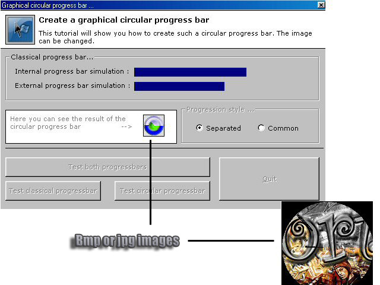



## Graphical circular progressbar

### Description

This simple code will teach you how to create a graphical progress bar. You'll see how to use classical progressbar, some maths (angle conversions), you'll use PSet functions. Nothing really hard, but it could help soem people arounde here. The code is a bit messy, but you should be able to understand it quite easily. It was written in 2000 and revised for PSC.

What's the interest? This is up to you to figure it out. I wanted to do this after seing Fix-it utilities progress bar. Have fun.
 
### More Info
 

             |
---                |---
**Submitted On**   |2003-08-01 16:54:52
**By**             |[brainwasher](https://github.com/Planet-Source-Code/PSCIndex/blob/master/ByAuthor/brainwasher.md)
**Level**          |Advanced
**User Rating**    |4.8 (19 globes from 4 users)
**Compatibility**  |VB 6\.0
**Category**       |[Miscellaneous](https://github.com/Planet-Source-Code/PSCIndex/blob/master/ByCategory/miscellaneous__1-1.md)
**World**          |[Visual Basic](https://github.com/Planet-Source-Code/PSCIndex/blob/master/ByWorld/visual-basic.md)
**Archive File**   |[Graphical\_183821192005\.zip](https://github.com/Planet-Source-Code/brainwasher-graphical-circular-progressbar__1-58192/archive/master.zip)

